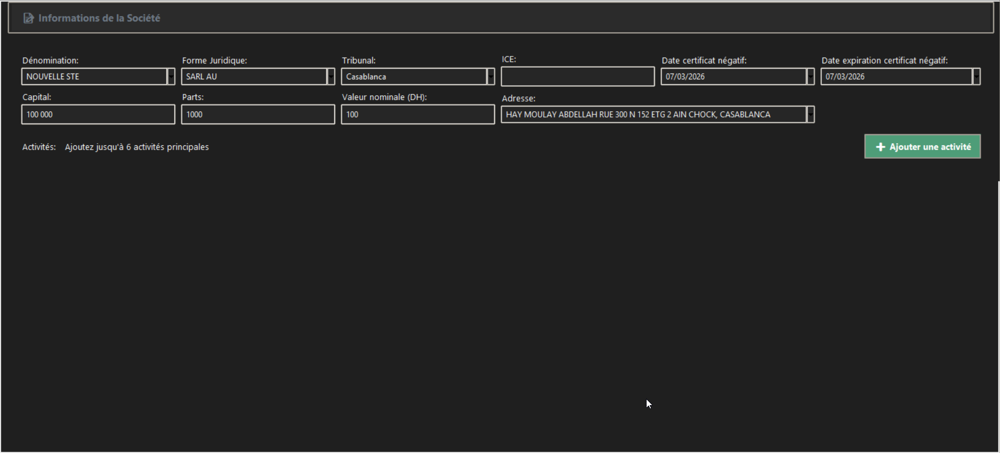
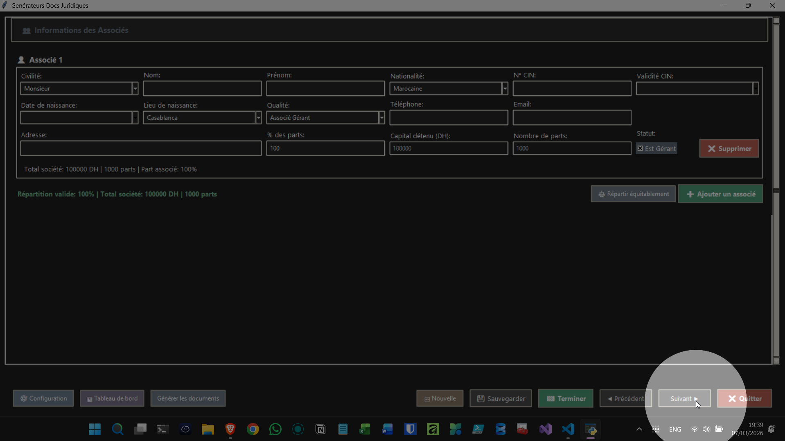
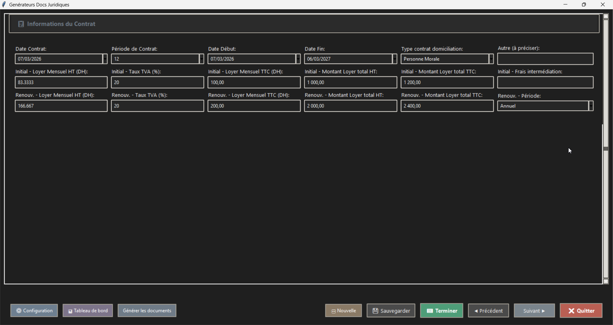
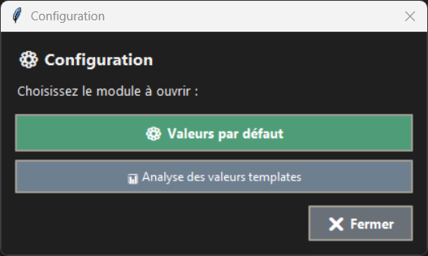
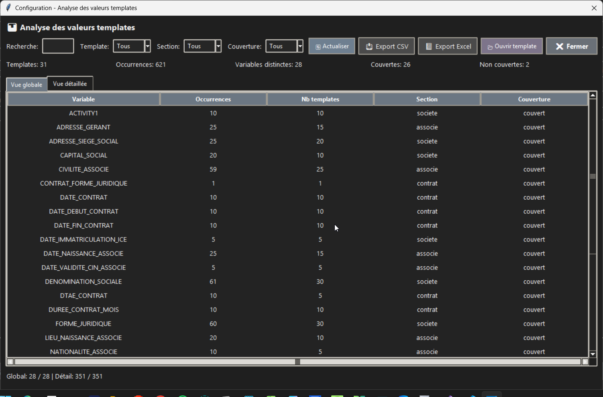

# Centre de Domiciliation

Application desktop (Python + Tkinter) pour gérer les sociétés, associés et contrats de domiciliation, avec génération de documents `.docx`/PDF.

## Version

- Version actuelle: `v.1`
- Convention de version (à partir de maintenant): `v.1`, `v.2`, `v.3`, ...

## Démarrage rapide

```powershell
git clone https://github.com/LearniTome/Center-Domiciliation-App.git
cd Center-Domiciliation-App
uv sync
uv run python main.py
```

## Nouveautés récentes (Mars 2026)

- Refonte des layouts formulaires (compacts, multi-colonnes) pour:
  - Société
  - Associés
  - Contrat
- `AssocieForm` renforcé:
  - civilité normalisée (`Monsieur` / `Madame`)
  - validation minimale bloquante avant sauvegarde/génération
  - meilleure logique de répartition des parts
- Nouveau hub `Outils`:
  - bouton `Générateur de Documents`
  - bouton `Convertisseur Word -> PDF (lot)`
  - bouton `Valeurs par défaut`
  - bouton `Analyse des valeurs templates`
- Nouvelle vue `Analyse des valeurs templates`:
  - vue globale + vue détaillée
  - filtres (recherche, template, section, couverture)
  - tri de colonnes
  - bouton `Actualiser`
  - export `CSV` / `Excel`
  - ouverture directe du template sélectionné
- Outil `Convertisseur Word -> PDF (lot)`:
  - sélection d'un dossier source
  - scan récursif des `.docx`
  - conversion vers `.pdf` dans le même dossier
  - rapport `HTML + JSON` dans `Outputs/Reports/`
- Profiling de démarrage:
  - rapport écrit dans `logs/startup_profile_last.json`

## Captures d’écran (UI)

Les captures sont référencées depuis `docs/images/ui/`.







## Documentation

- [Quick Start](docs/setup/QUICKSTART.md)
- [Setup](docs/setup/SETUP.md)
- [Guide génération (selector)](docs/guides/USER_GUIDE_GENERATION_SELECTOR.md)
- [Gestion des valeurs par défaut](docs/guides/DEFAULTS_MANAGEMENT.md)
- [Troubleshooting](docs/guides/TROUBLESHOOTING.md)
- [Architecture](docs/architecture/ARCHITECTURE.md)
- [Index complet de la doc](docs/README.md)

## Fonctionnalités principales

- Saisie et édition des données Société / Associés / Contrat
- Sauvegarde dans Excel (`databases/DataBase_domiciliation.xlsx`)
- Génération de documents Word depuis `Models/`
- Conversion PDF (si environnement compatible)
- Conversion en lot Word -> PDF depuis `Outils`
- Sélection de templates par type/forme juridique
- Tableau de bord de consultation et actions rapides

## Configuration

- Préférences générales: `config/preferences.json`
- Valeurs par défaut métier: via `Outils > Valeurs par défaut`
- Dossier de sortie génération: `tmp_out/`
- Dossier de rapports conversion Word -> PDF: `Outputs/Reports/`

## Tests

```powershell
uv run python -m unittest tests.test_template_value_analyzer tests.test_configuration_hub -q
```

Ou suite complète (si `pytest` installé):

```powershell
uv run python -m pytest -q
```

## Structure du projet

```text
main.py
src/
  forms/
  utils/
Models/
databases/
config/
tests/
docs/
```

## License

MIT
